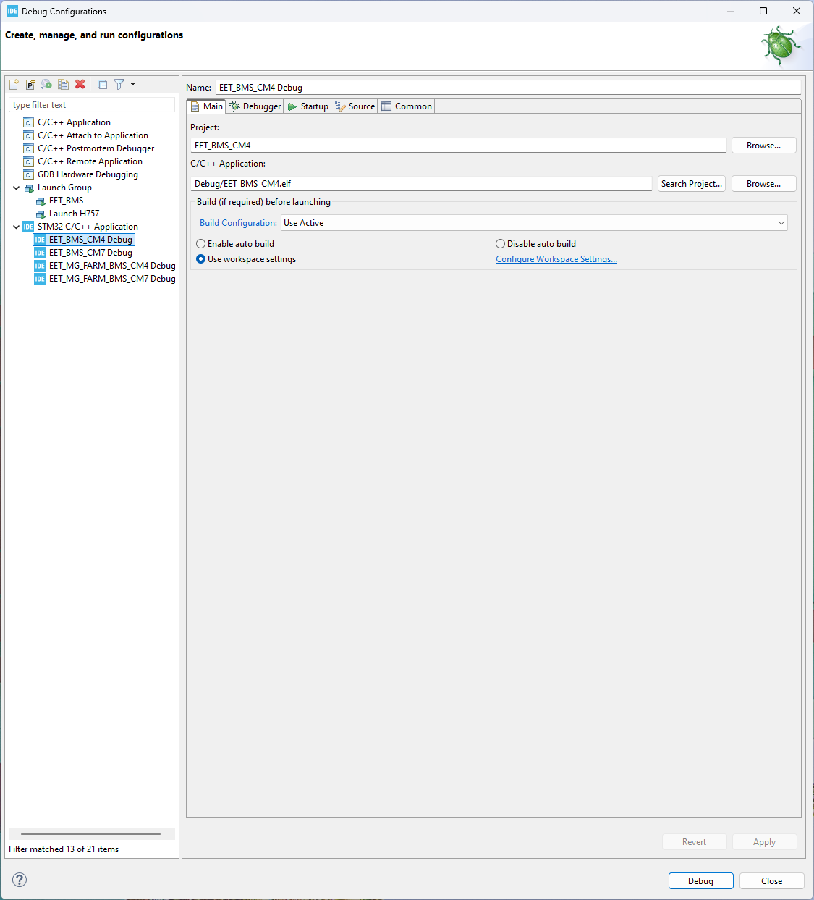
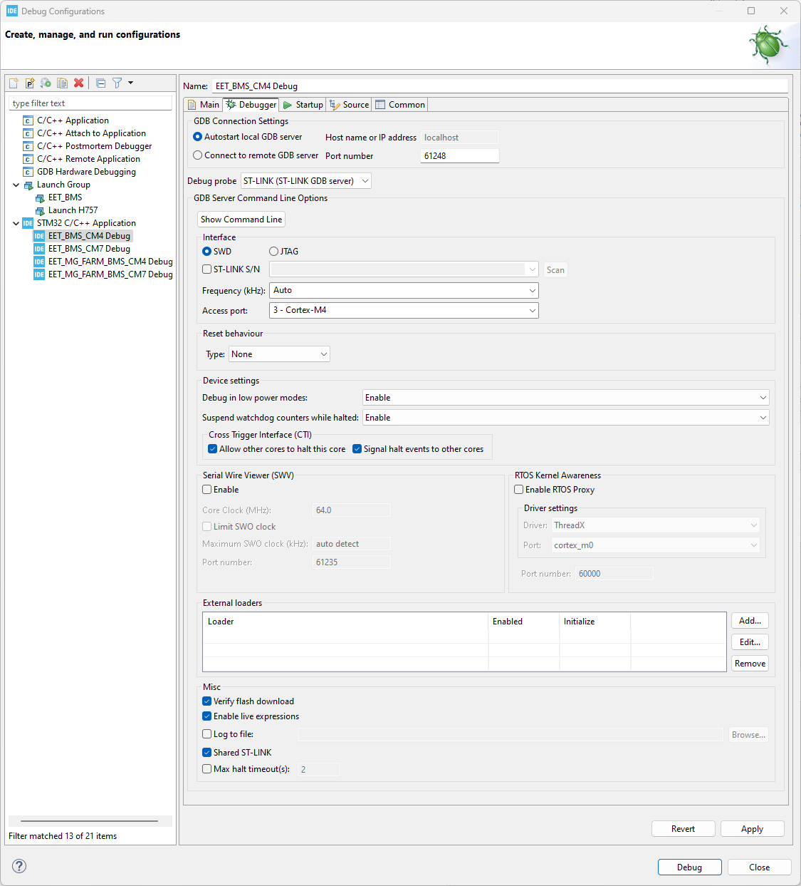
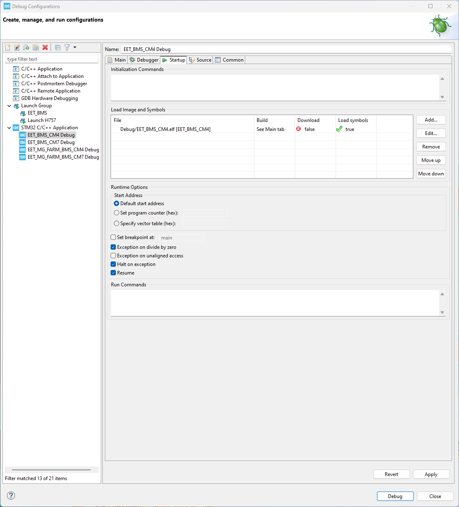
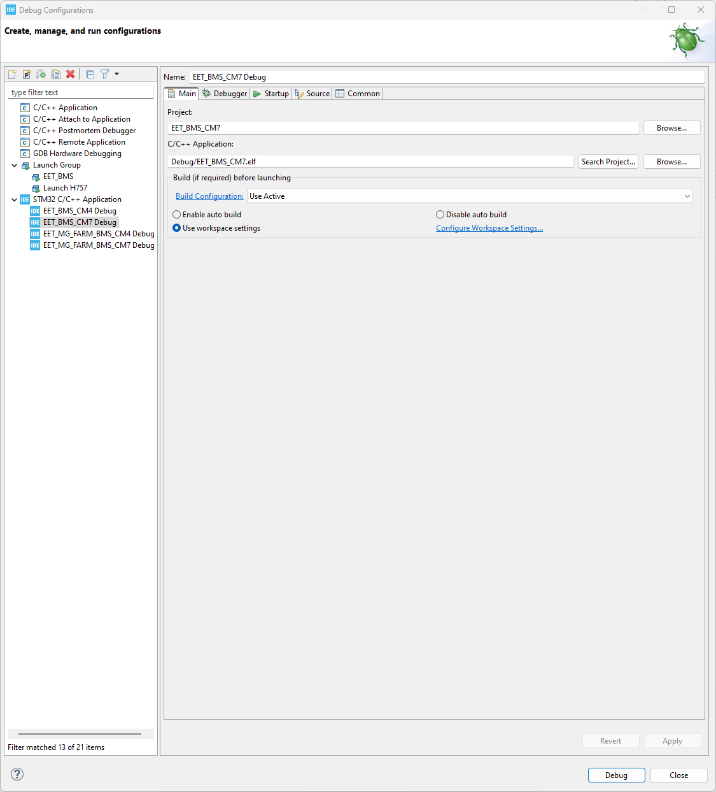
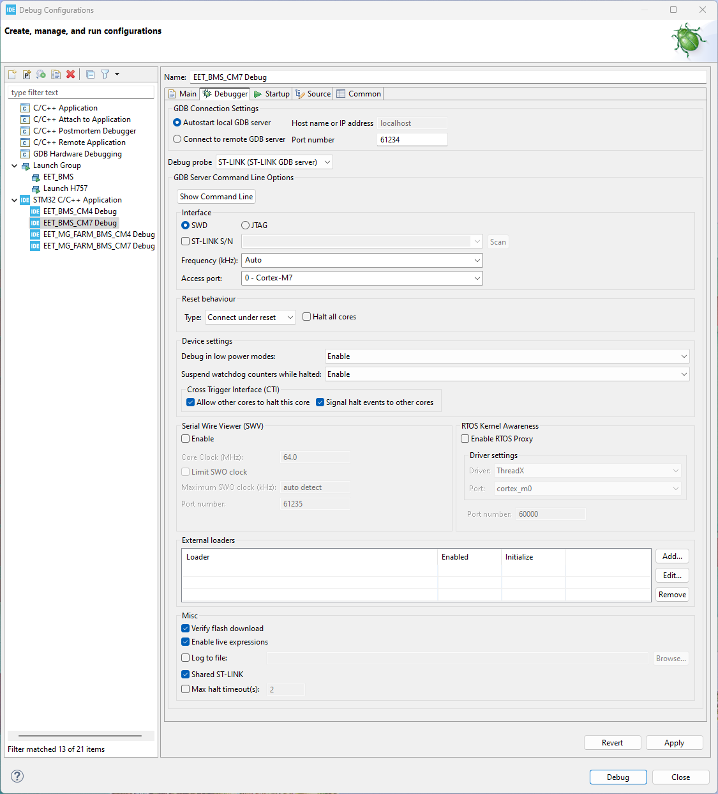
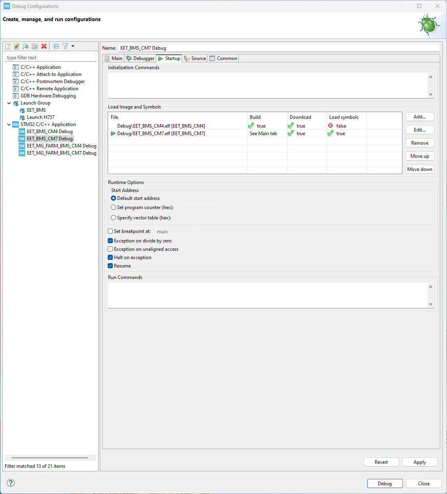
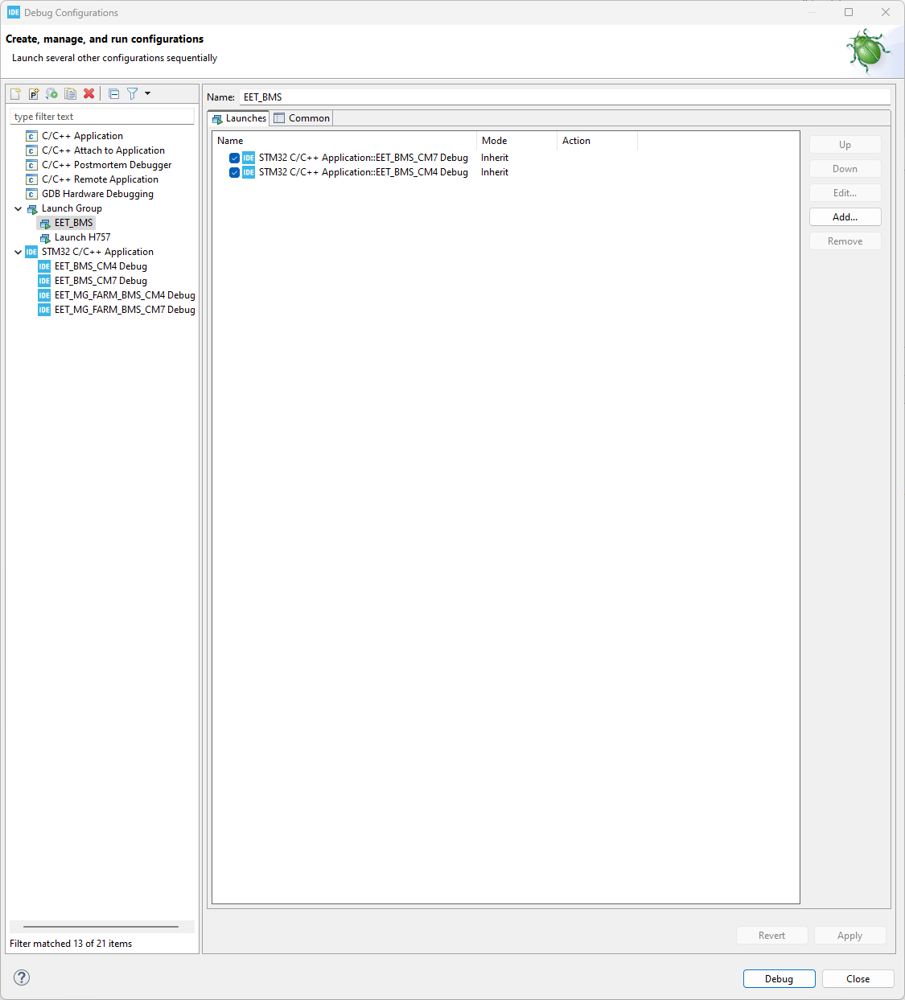

# Configurations for the Debugger in CubeIDE
The STM32H755 used in this project is a rather complex dual-core MCU. This leads to some additional configuration required to set up the project to debug properly. Thankfully, ST documented the process in [AN5361](https://www.st.com/resource/en/application_note/dm00629855-getting-started-with-projects-based-on-dualcore-stm32h7-microcontrollers-in-stm32cubeide-stmicroelectronics.pdf). Make sure to also deactivate the initial breakpoint in the debug configurations of both MCUs to prevent faults when starting the debug session via the debug group.

## Debugging Settings

For effective debugging of the BMS, it is essential to correctly modify the **Debug Configuration** settings. The primary reference for this process is the official documentation from STMicroelectronics.

A key resource is the application note [AN5361](https://www.st.com/resource/en/application_note/dm00629855-getting-started-with-projects-based-on-dualcore-stm32h7-microcontrollers-in-stm32cubeide-stmicroelectronics.pdf)**: _Getting started with projects based on dual-core STM32H7 microcontrollers in STM32CubeIDE_.

For the general setting configuration, you can refer to **Chapter 3**. However, please note that there are specific minor changes required for the BMS project. These project-specific modifications must be applied to ensure compatibility and stability.

### CM4 

For the CM4 are following setting needed:
##### CM4 Main

#### CM4 Debugger

#### CM4 Startup

### CM7

For the CM7 are following setting needed: 
#### CM7 Main

#### CM7 Debugger

#### CM7 Startup

in this setting you have to add both CPUs. 

## Launch Group

To debug the STM32H7, you have two primary options for managing the dual-core architecture (Cortex-M7 and Cortex-M4):
1. **Sequential Debugging:** You have the possibility to debug the cores manually by starting with the **CM7** first, followed by the **CM4**.
2. **Launch Group (Recommended):** Alternatively, you can create a "Launch Group" within STM32CubeIDE. Using a launch group allows both processors to start successively in an automated manner.
When setting up a launch group, it is critical to follow the correct order: you must add the **CM7** first and then the **CM4**.

