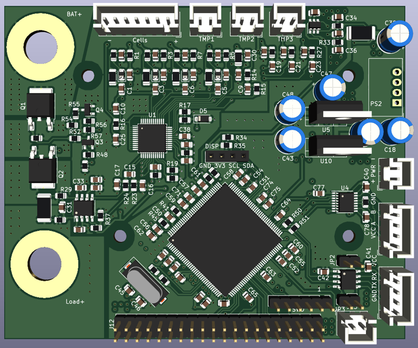

# Getting Started

The EET-BMS is a BMS solution developed to monitor battery packs with 3 to 4 cells in series for aging tests and to provide a platform for developing and validating state-of-the-art state estimation algorithms using battery testers and hardware available at EET.

To get started working with the BMS, you will need:

- 1x Assembled BMS Board
- 1x ST-Link (optional for programming and debugging)
- 1x Pack with 4s cell configuration
- 1x M8 cable lug for the positive battery terminal
- up to 3x NTC Sensors
- 1x USB-RS485 Converter
- 1x USB-UART Converter (optional)
- 1x 5V Supply
- 1x 3D-Printed Holder
- 4x M3 Screws
- 1x M8 Screw and Nut

The assembled PCB is first mounted on the 3D-printed holder using the 4 M3 Screws. In the next step, the Battery can be secured with zip ties. The Cell connector coming from the battery pack is connected to the 7-Pin connector marked with Cells. You need only 6-Pins because the BMS internal regulator is powered by the external power source, not the batteries. Make sure that the orientation of the cell connector is correct and the highest Potential is on the right side of the connector, marked with + on the PCB. The NTC Sensors are connected in a similar way with the three 2-pin connectors next to the cell connector marked with TMP1, TMP2 and TMP3.

The Potential of these connectors is directly tied to the negative Potential of the battery pack! For Power and communication, the connectors on the lower right side of the PCB are used. The 2-Pin connector is used as the 5V Power supply for the STM32, isolators, etc., while the 4-pin connectors provide a RS-485 and a UART Interface. Note that the supply as well as the interfaces are galvanically isolated from the rest of the PCB as well as each other. As a result, the _VCC_ and _GND_ Pins for the serial interfaces _are required_ and not optional!

To program the board, the SWD interface is located on the 6-Pin 2.54mm header at the bottom of the PCB. The Pinout follows the standard ST-Link layout, with pin 1 indicating the VDD_Target Pin of the ST-Link. The Debugging interface is _not_ isolated from the battery potential.

After programming and turning on the PCB for the first time, the display should show information about the cell voltage, temperature sensors, current, as well as the systick of the last measurement in milliseconds.

If everything works up to this point, the battery tester can be connected to the Battery. For that, the positive current wire of the cell tester is connected with the Load+ terminal of the PCB via a cable lug and an M8 screw. The Sense+ wire of the battery tester has to be connected with the Bat+ terminal, together with the positive terminal cable coming from the Battery. The negative terminal of the Battery is directly connected with the negative sense wire and negative current wire from the battery tester.

## Repo organization

This repository is structured in three main subfolders:

- The Hardware folder holds all necessary PCB schematic, Layout and production files
- The Firmware folder contains the STM32 Source Code and supporting files
- The Docs Folder contains the documentation of the project

## Toolchains

To work on this project it is required to install a toolchain to work with STMs .ioc format. While the VSCode Plugin in combination with CubeMX is getting continuously better, I recommend installing the STM32 Cube IDE for working with the Firmware. Furthermore, to view and edit the schematic and Layout, a KiCAD 7 or newer installation is required. The 3D models for the stand are modeled in Fusion 360 but are included as .step and .stl in this repo, so any 3D CAD program should do the job.

The logging Software for a connected PC is written in Python. Dependencies can be installed via pip using the requirements.txt file. Note that the serial interface used for the main bus between the host and BMS boards is based on RS-485, so an RS-485 to USB converter is required for connecting to the bus.

