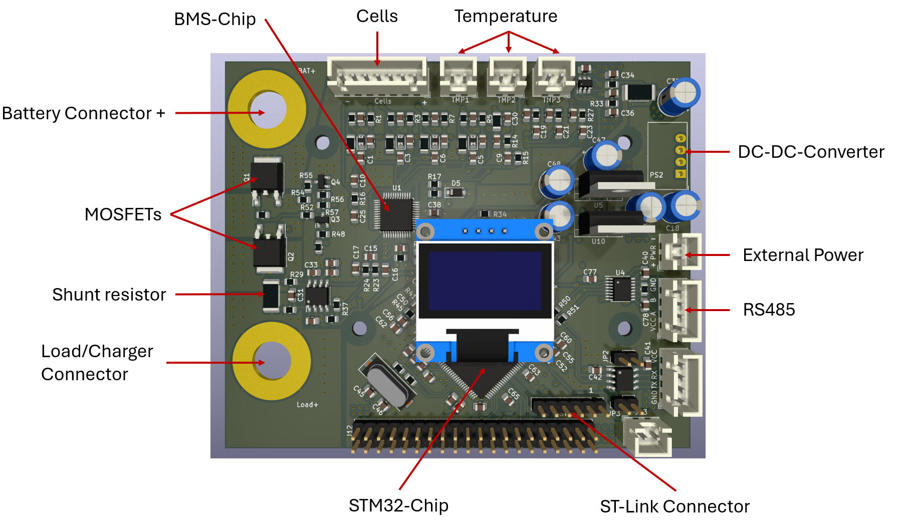

# Hardware
Here are the main parts of the BMS-Hardware described. It includes the BMS-Chip, the Microcontroller and Power supply scheme. For understanding where the components are located the following graph was created:

## Hardware files

The hardware design files for this project are centrally located within the repository at the following path: `Hardware/EET_BMS_Layout`.

This directory contains the comprehensive PCB Layout files and the Circuit Plan (Schematic). To ensure clarity and ease of navigation, the circuit plan is organized into three primary functional sections:
### 1. Current Sense Amplifier
This section focuses on the protection path and current monitoring. 

The protection path includes a bidirectional switch that allows separate control of charging and discharging directions. This separation simplifies safety interlocks during experiments and enables targeted tests such as charge-only preconditioning or discharge-only profiling without rewiring the pack harness. Figure 13 shows the detailed PMOS arrangement and gate-drive routing that implement this bidirectional control.

The bidirectional switching stage consists of two P-channel power MOSFETs (Q1, Q2, SUD19P06-60) connected source-to-source at the SSR junction, enabling current flow in both directions through their opposing body diodes. Gate networks (R47/R54: 33 kΩ, R52/R55: 100 Ω) hold both MOSFETs off at ≈BAT+ when no control signal is applied. Two N-channel MOSFETs (Q3, Q4, BSS138) act as low-side gate drivers: when activated, they pull the respective gate of Q1 or Q2 to ground, creating the required negative gate-source voltage to turn the P-channel device on. Additional dividers (R49/R57: 33 kΩ, R48/R56: 100 Ω) condition the drive signals for Q3 and Q4.

When BAT_Relay_Charge = HIGH, Q3 turns on and pulls down the gate of Q1, enabling the charge path from BAT+ to the SSR junction. When BAT_Relay_Discharge = HIGH, Q4 pulls down the gate of Q2, activating the discharge path from the battery through the SSR junction to the shunt. With both signals low, Q3 and Q4 remain off, and both power MOSFETs stay disabled. The arrangement provides fully bidirectional control of charge and discharge currents with low voltage drop thanks to the parallel MOSFET configuration and the 5 mΩ shunt.

For the current measurement a shunt of 5 mΩ and the current sense amplifier is used. The voltage is send to the BMS-Chip as seen in the layout. 

### 2. BMS Frontend

In the BMS Frontend the schematics of the TLE9012DQU and the passive balancing are shown. 

The TLE9012DQU is the main BMS IC for the BMS. Its task is to provide analog-to-digital conversion of cell voltages, temperatures and current, as well as implement part of the necessary circuitry for passive cell balancing. The BMS setup monitors four series-connected cells, the pack current as well as 3 NTC based temperature sensors. The current design uses only 4 of the 12 available channels of the TLE9012DQU. The PCB Schematic mainly follows the reference design outlined in the [user manual](https://www.infineon.com/dgdl/Infineon-Infineon-TLE9012DQU_TLE9015DQU-UM-v01_00-EN-UserManual-v01_00-EN.pdf?fileId=8ac78c8c7e7124d1017f0c4f8750574b&da=t).  This is sufficient for the laboratory stack. For more than 12 cells, the setup can easily be expanded by using multiple TLE9012DQU in daisy chain mode, where one BMS IC transmits their data to the next IC in the chain using a proprietary galvanically isolated interface.

![[BMS_Frontend.png]]

The Figure above shows the active front-end. It also illustrates the input-filter and balancing network. Although the TLE9012DQU integrates the balancing MOSFETs internally, the external bleed resistors and filtering components are distributed on the board to support reliable cell equalisation even though this inevitably places some load on the harness during balancing. Unused cell inputs of the TLE9012DQU are terminated according to the reference design for a 12-to-4 cell reduction, ensuring that measurement integrity on the active cell taps is maintained. The integrated ADC’s are used for the cell-voltage and temperature sensing and leave space to allow switching to Bipolar Auxiliary Voltage Measurement (BAVM) if BAVM measurement becomes desirable. This is possible through the TMP3 and TMP4 channels. Thermal monitoring is implemented via a NTC harness that connects to the MCU and 3 NTC at the TLE9012. 

The TLE9012DQU communicates with the STM32 controller and provides cell-voltage, current and temperature data, controls balancing switches and communicates faults via the dedicated Error net.

Documentation for this IC is scattered across the [datasheet](https://www.infineon.com/dgdl/Infineon-TLE9012DQU-DataSheet-v01_00-EN.pdf?fileId=8ac78c8c7e7124d1017f0c3d27c75737) and the [user manual](https://www.infineon.com/dgdl/Infineon-Infineon-TLE9012DQU_TLE9015DQU-UM-v01_00-EN-UserManual-v01_00-EN.pdf?fileId=8ac78c8c7e7124d1017f0c4f8750574b&da=t). The datasheet provides mainly information about the electrical characteristics of the chip, while the user manual contains the register map, a reference schematic, some additional information, and a few example commands. If there is some information missing in both the user manual and the datasheet, it is usually a good idea to check the datasheet of the rather similar predecessor, [TLE9012AQU](https://www.mouser.com/datasheet/2/196/Infineon_TLE9012AQU_DataSheet_v01_10_EN-1890780.pdf).

The PCB Schematic mainly follows the reference design outlined in the user manual, with the main difference being the reduction of the number of connected cells from 12 to just 4. Unused channels are connected to the GND potential. In addition, the single-wire UART interface is used instead of the ISO-UART, which is used in the reference design. To allow for bidirectional current measurements, the TMP3 and TMP4 channels are used with the BAVM function of the TLE9012. The BAVM function allows for repurposing the 16-bit ADC used for independently measuring the sum voltage of all cells as a bipolar ADC on inputs TMP3 and TMP4.

According to the TLE9012DQU datasheet, the VS pin should typically be connected to the highest cell of the battery pack. However, during testing, we encountered an issue where the supply current for the internal regulator caused an excessive drain on the batteries.

To prevent this parasitic discharge, we have modified the layout to supply the TLE9012DQU’s internal regulator from the same external power source used for the STM32H755.

### 3. STM MCU (Microcontroller Unit)

This section details the heart of the system, featuring the **STM32H7** microcontroller. It illustrates all relevant connections and pin assignments, specifically including:
- **Decoupling Networks:** Dedicated decoupling for `VDD`, `VDDA`, `USB`, and `VDDLDO` to ensure signal integrity.
- **Power Rails:** Specific layouts for the `VDD` and `VDDA` power supplies.
- **NTC Array:** The interface for the Negative Temperature Coefficient thermistor sensors.
- **Communication Interfaces:**
    - **Isolated UART:** For safe, noise-resistant serial communication.
    - **Isolated RS485:** For robust industrial-grade data transfer.
- **Power Management:** The **DC-DC Converter** for internal voltage regulation.
- **User Interface:** The connection and driver circuitry for the **OLED Display**.
- **Programming/Debugging:** The **Debugger Connection** for firmware uploads and real-time troubleshooting.

## Microcontroller: STM32H755ZI

To ensure enough computation power to test modern state estimation techniques, a dual-core STM32 microcontroller is used, offering an ARM Cortex M4 and M7 core, with 1Mbyte of Flash per Core as well as 1Mbyte of SRAM.

The schematic of the microcontroller section is a bare-bones implementation of the STM32H755 as described in the datasheet. The H755 offers the possibility to increase efficiency by using some external components to form a switching mode regulator. Due to reasons of simplicity, this is not implemented in this design and the internal linear regulator is used to supply the core voltage.

In terms of communication interfaces, three UARTs of the STM32 are in use, UART Peripheral 1 is used as an isolated UART, which can be connected to a UART-USB connector. For communication between a host and multiple BMS boards, UART3 is used in combination with an isolated RS485 transceiver, which implements a custom serial protocol. The third UART is used in single wire mode to communicate with the TLE9012DQU (see the known quirks and errors section for further information).

## Power Supply Scheme

While the TLE9012DQU supplies itself from the Battery, the STM32 would overload the internal regulator of the TLE, so an independent power source is necessary. The supply is therefore ensured by using an isolated DC/DC 5V to 5V converter with the primary side supplied by the Host. The DC/DC itself is unregulated and has an ensured output voltage of at least 4.5V. Therefore, two independent 3V3 regulators are used to supply digital and analog ICs with 3V3.

To monitor the current consumption of the STM32 and supporting ICs, it is possible to optionally utilise a shunt and a current sense amplifier connected to the ADC peripheral of the STM.

## Current Measurement and Solid State Relay

To protect the Battery in case the BMS detects an error, a solid-state relay consisting of two PMOS acting as a high-side switch in a common-source configuration is used. To allow current to flow in and out of the Battery, the BMS needs to actively pull the Gates of the PFETs to GND. This is achieved by a logic-level NFET connected to a GPIO on the STM.

In Series with the Solid State Relay is a 5 m Ohm shunt resistor with a TSC2012 current amplifier. The Amplifier connects to the TLE9012DQU and is biased by a resistor divider to measure bidirectional currents. The reference is also measured by the TLE9012DQU, so no additional compensation is required by the user.

## Passive Balancing

Currently the BMS provides a passive Balancing of 70 mA.  

## Tips during assembly

Assembly is rather straightforward, but I suggest using a stencil as well as lead-free solder paste. Make sure to keep the amount of excessive solder paste as low as possible to prevent solder bridges under the Pins of the STM and TLE. While placing the components, make sure that components marked as DNP (do not populate) are not placed on the PCB, which may lead to unexpected behavior.

After soldering the SMD components, it is highly recommended to check that a debug connection to the STM can be established using the ST-Link and a lab-bench power supply.

## Pinout Table

Pinout for J2 (Battery Connector):

| Pin number | Pin name | Pin net         |
|------------|----------|-----------------|
| 1          | Pin\_1   | Bat+            |
| 2          | Pin\_2   | Cell\_4+        |
| 3          | Pin\_3   | Cell\_3+        |
| 4          | Pin\_4   | Cell\_2+        |
| 5          | Pin\_5   | Cell\_1+        |
| 6          | Pin\_6   | Cell\_1-        |
| 7          | Pin\_7   | Bat-            |

Pinout for J4 (TMP1):

| Pin number | Pin name | Pin net                |
|------------|----------|------------------------|
| 1          | Pin\_1   | NTC+                   |
| 2          | Pin\_2   | NTC-                   |

Pinout for J3 (TMP2):

| Pin number | Pin name | Pin net                |
|------------|----------|------------------------|
| 1          | Pin\_1   | NTC+                   |
| 2          | Pin\_2   | NTC-                   |

Pinout for J1 (TMP3):

| Pin number | Pin name | Pin net                |
|------------|----------|------------------------|
| 1          | Pin\_1   | NTC+                   |
| 2          | Pin\_2   | NTC-                   |

Pinout for J9 (CPower Supply):

| Pin number | Pin name | Pin net         |
|------------|----------|-----------------|
| 1          | Pin\_1   | 5V              |
| 2          | Pin\_2   | GND             |

Pinout for J6 (RS485):

| Pin number | Pin name | Pin net         |
|------------|----------|-----------------|
| 1          | Pin\_1   | RS485-VCC (3.3-5V)    |
| 2          | Pin\_2   | A               |
| 3          | Pin\_3   | B               |
| 4          | Pin\_4   | RS485-GND       |

Pinout for J8 (UART\_Shell):

| Pin number | Pin name | Pin net         |
|------------|----------|-----------------|
| 1          | Pin\_1   | UART-GND        |
| 2          | Pin\_2   | TX              |
| 3          | Pin\_3   | RX              |
| 4          | Pin\_4   | UART-VCC (3.3-5V) |

Pinout for J10 (SW\_Debug\_Connector):

| Pin number | Pin name | Pin net        |
|------------|----------|----------------|
| 1          | Pin\_1   | +3V3           |
| 2          | Pin\_2   | SWCLK          |
| 3          | Pin\_3   | GND            |
| 4          | Pin\_4   | SWDIO          |
| 5          | Pin\_5   | NRST           |
| 6          | Pin\_6   | SWO            |
